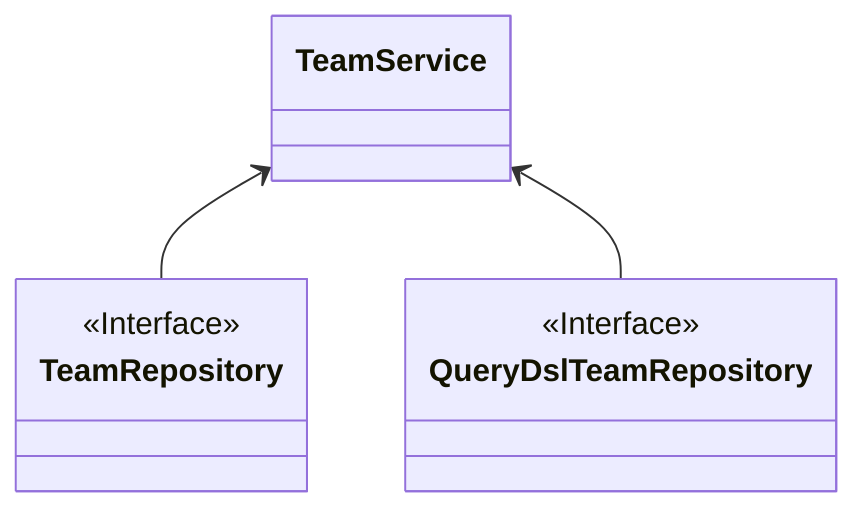
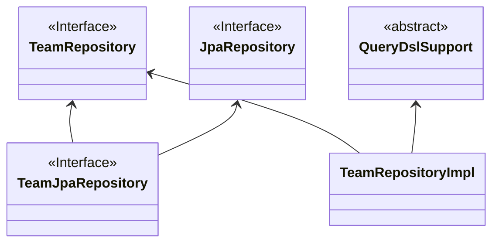

# 이슈 관리 프로젝트

## 목차

### 1. [프로젝트 설명](#1-프로젝트-설명)

### 2. [이전 코드에 비해서 개선된 부분](#2-이전-코드에-비해서-개선된-부분)

### 3. [버전 관리](#3-버전-정보)

### 4. [아쉬운 점](#4-아쉬운-점)

### 1-프로젝트-설명

DB
- 상대적으로 읽기와 쓰기가 많은 프로젝트라고 생각하여 Postgresql 을 사용 하였습니다
- 해당 프로젝트가 검색을 할 상황이 많았거나 다양한 정보가 들어갈 필요가 있었다면 NoSQL 을 사용해보려 했지만 시간 상의 문제와 이번 프로젝트와 부적합하다는 판단을 하였습니다

#### Issue

- 이슈를 등록, 조회, 수정, 삭제 할 수 있는 API 입니다
- 이슈를 등록 및 수정 할 시에 Amazon S3를 이용해서 이미지 업로드 및 수정이 가능하게끔 구성하였습니다 (조회는 어떤 방식으로 할지 몰라서 일단 스킵했습니다)
- 이슈 삭제시에 Soft Delete를 구현하였습니다
    - 이유는 실수로 이슈 삭제가 되는 상황 방지 및 단기간 내에 같은 이슈 발생시에 해당 이슈를 다시 복원 시키려는 목적입니다
    - 따라서 Spring Scheduler를 통해서 90일까지 보관을 하고 90일이 지난 이슈는 삭제를 하게끔 구현하였습니다 (이거 테스트 상황에서 조금 문제가 있는데 시간이 안되서 튜터링 시간 때 한번 찾아가겠습니다)

#### Comment

- 코맨트를 등록, 수정, 삭제 할 수 있는 API 입니다
- 현재는 연관 이슈쪽에서만 조회 될 수 있도록 조치를 해놨습니다
    - 그러나 추후에 내가 쓴 코맨트 API 이런 것도 고안 할 수 있을 것 같다는 생각이 듭니다

#### Member

- 유저의 회원가입과 로그인에 관한 API입니다
- 이번에는 JWT 만으로 인증을 구현했습니다
    - 원래 시간이 남으면 OAuth 까지 구현하려고 했으나 중간에 버그가 터져서 시간이 좀 부족했습니다
#### Team

- 유저의 권한을 관리하는 API 입니다
- 유저가 최초에 팀을 생성할 경우 리더로 승격하고 이 후에 다른 팀원을 영입할 수 있습니다
- 유저 1명당 하나의 팀만 가지게 됩니다
- 리더나 관리자는 팀원 추가, 방출 또는 팀 해체가 가능합니다


### 2-이전-코드에-비해서-개선된-부분

### 브렌치 Before와 참고해서 봐주셨으면 좋겠습니다

1. Repository 코드 개선
    - 기존에 Repository를 QueryDSL 전용과 JPA 전용을 Service로 동시에 주입 받는 방법을 선택했지만 한단계 더 추상화를 시켜서 Repository 내부에서 모든 일을 처리 할 수 있도록 코드를 개선했습니다
- AS-IS

- TO-BE


2. 인증 실패 및 인가 부분을 Spring AOP 로 정의
    - 기존에는 직접 컨트롤러와 비즈니스 로직에 작성하는 방식을 채택했다면 AOP 방식을 사용하여 중복되는 코드를 줄이고 추가적으로 특정 의존성 까지 없애는 효과 까지 확인했습니다
- AS-IS
```
    fun updateTeam(email: String, teamId: Long, teamRequest: TeamRequest): String {

        val member = memberService.searchEmail(email)

        validAuthentication.role(member.getRole(), AuthenticationType.LEADER_AND_ADMIN)

        val team = teamRepository.findByIdOrNull(teamId) ?: throw ModelNotFoundException("id", teamId.toString())

        if (teamId == DUMMY_TEAM) throw DummyTeamException(null)

        if(member.getRole() == Role.LEADER && team != member.getTeam()) throw IllegalArgumentException("본인 소속 외에 다른 팀은 선택할 수 없습니다")

        team.update(teamRequest)

        teamRepository.save(team)

        return "팀 명 변경이 완료 되었습니다 변경된 팀 명 : ${teamRequest.name}"
    }
```
- TO-BE
```
    @CheckAuthentication(authenticationType = AuthenticationType.LEADER_AND_ADMIN)
    @LeaderChoosesOtherTeam
    @CheckDummyTeam
    override fun updateTeam(email: String, teamId: Long, teamRequest: TeamRequest): String {
        val team = teamRepository.findByIdOrNull(teamId) ?: throw ModelNotFoundException("id", teamId.toString())

        team.update(teamRequest)

        teamRepository.save(team)

        return "팀 명 변경이 완료 되었습니다 변경된 팀 명 : ${teamRequest.name}"
    }
```
3. Service 로직 한단계 추상화 진행
    - Service 로직을 한단계 추상화를 진행하기는 했지만 사실 광범위하게 사용하는 서비스로직은 따로 나눠놨고 Spring AOP로 로직도 간소화 했기 때문에 가독성에서는 간소화 되어 따로 지금 단계에서는 의미가 없다고는 생각하지만 장래에 추가적인 Service를 위해서 추상화를 진행하였습니다

### 3-버전-정보

- Kotlin : 1.9.24
- Spring : 3.3.0
- QueryDSL : 5.1.0
- jjwt : 0.12.5
- aws : 2.4.4
- db_URL : myissue@database-1.cv2wouwc2ul2.ap-northeast-2.rds.amazonaws.com
- databaseName : myissue

### 4-아쉬운-점

1. OAuth 를 사용하여 인증을 구현하는 점
    - 사실 Jwt는 이번에도 그렇고 나름 동작 방식을 이해 하기는 했습니다 그러나 OAuth 는 동작 방식을 이해는 했으나 Jwt를 확실하게 이해하고 넘어가는 부분 + 버그 때문에 시간을 많이 사용 하지 못한 점이 아쉽습니다
2. AWS에 대한 개념이 제대로 잡혀있지 않은점
    - 이번에는 로컬 DB를 통해서 구축을 했는데 결국 해당 Application을 테스트 하려면 서버용 컴퓨터가 필요하여 AWS에다가 데이터 베이스를 구축하는 데 많은 시간을 들였습니다
    - 기존에는 EC2 에다가 DB를 구축 하는 방식 으로 접근 하려고 했으나 성능 이슈로 접근이 되지 않아서 RDS 접근 방식으로 바꿨습니다

3. Spring AOP 부분 간단한 로직이 생각 보다 테스트 하기 어려 웠습니다
    - 기존에 튜터 님께 물어 봤던 @checkAuthentication 같은 경우는 튜터님 께서 말씀 해주신 대로 내부 함수와 로직을 Mock 처리하고 필요한 부분만 테스트 를 진행 하였습니다
    - 이외에 나머지 Annotation 같은 경우는 간단한 로직 처리이기 때문에 Service 로직에서 한꺼번에 테스트를 하려고 하는데 어떤 방식으로 테스트를 해야 할지 감이 안잡힙니다
      - 우선 생각한 부분은 테스트 코드에 직접 로직을 구현하는 것인데... 이 방법은 테스트 코드와 맞지 않다고 생각이 듭니다 
      - 아니면 위에 말씀 주신 대로 하면 다른 Annotation 도 메서드로 만들어서 해당 부분만 처리를 할 수 있긴 한데 AWS로 시간이 너무 많이 뺏겨서.. 우선 보류 하였습니다


