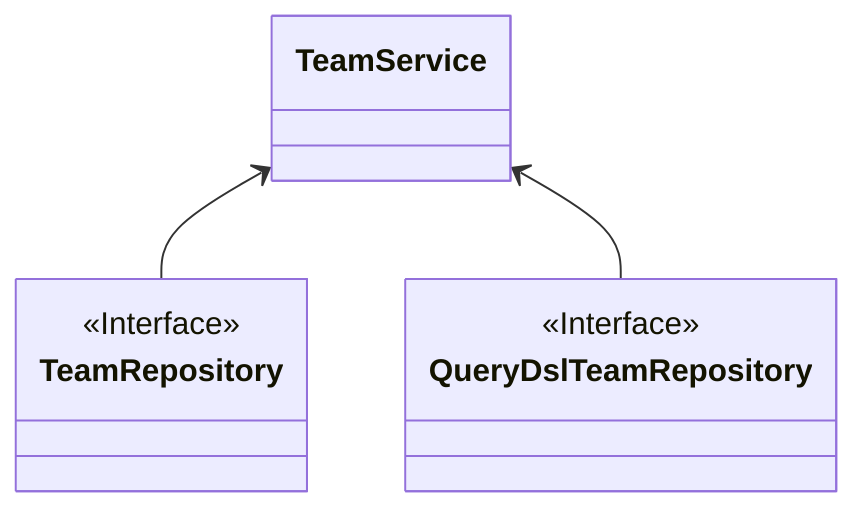
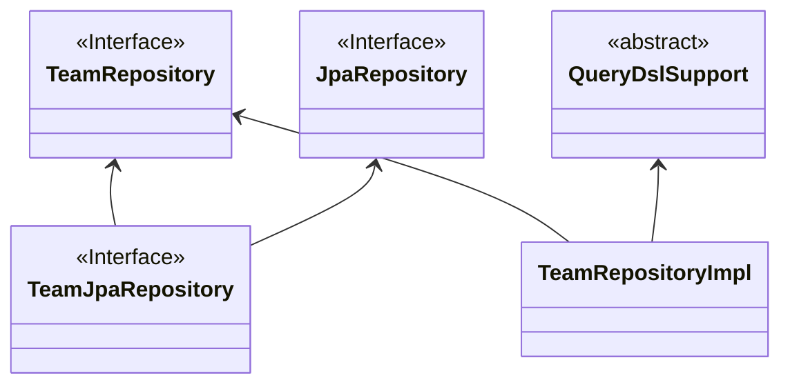

# 이슈 관리 프로젝트

## 목차

### 1. [프로젝트 설명](#프로젝트-설명)

### 프로젝트-설명

```mermaid
classDiagram
    
    TeamService <-- TeamRepository
    TeamService <-- QueryDslTeamRepository
    
    class TeamRepository{
        <<Interface>>

    }

    class QueryDslTeamRepository{
        <<Interface>>

    } 
```

```mermaid
classDiagram


    TeamRepository <-- TeamJpaRepository
    TeamRepository <-- TeamRepositoryImpl
    QueryDslSupport <-- TeamRepositoryImpl
    JpaRepository <-- TeamJpaRepository

    class TeamRepository{
        <<Interface>>

    }

    class TeamJpaRepository{
        <<Interface>>

    }

    class JpaRepository{
        <<Interface>>

    }

    class QueryDslSupport{
        <<abstract>>
    }

```
